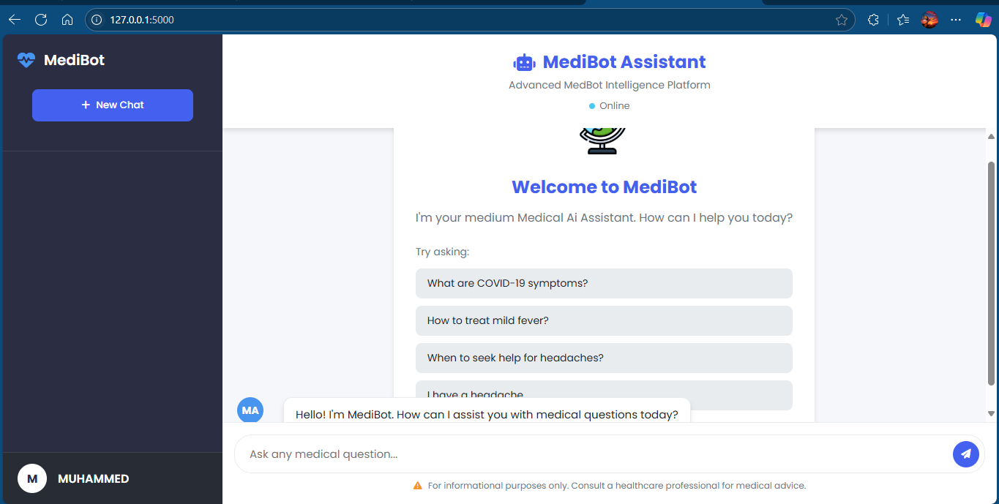

---

## 🏥 Medical QA Flask App

This is a Flask-based web application designed for medical question answering. It utilizes a JSON-based knowledge base to provide accurate responses to user questions.

---

### 📁 Project Structure

```
MEDIAI/
│
├── static/                 # Static assets (CSS, JS, images)
├── templates/              # HTML templates
│   └── index.html
├── .env                    # Environment variables
├── app.py                  # Main Flask application
├── medical_qa.json         # Medical Q&A data
├── requirements.txt        # Python dependencies
└── README.md               # Project documentation
```

---

### 🚀 Getting Started

#### Prerequisites

* Python 3.7+
* pip

---

### 🛠 Installation

1. **Clone the repository**

```bash
git clone https://github.com/yourusername/medical-qa-flask-app.git
cd medical-qa-flask-app
```

2. **Create a virtual environment**

```bash
python -m venv venv
source venv/bin/activate  # On Windows: venv\Scripts\activate
```

3. **Install dependencies**

```bash
pip install -r requirements.txt
```

4. **Create a `.env` file**

Add your environment variables in the `.env` file (optional for advanced configurations).

5. **Run the Flask app**

```bash
python app.py
```

---

### 🌐 Access the App

Once running, open your browser and go to:

```
http://127.0.0.1:5000
```

